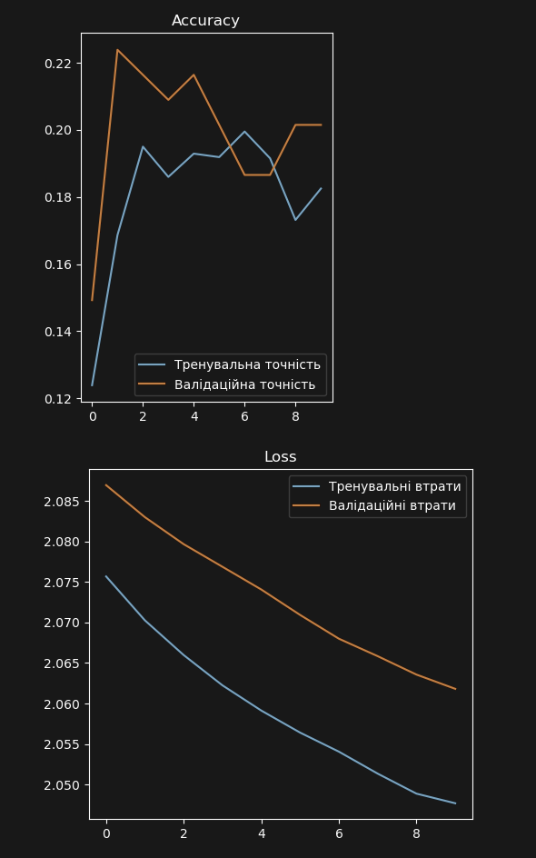
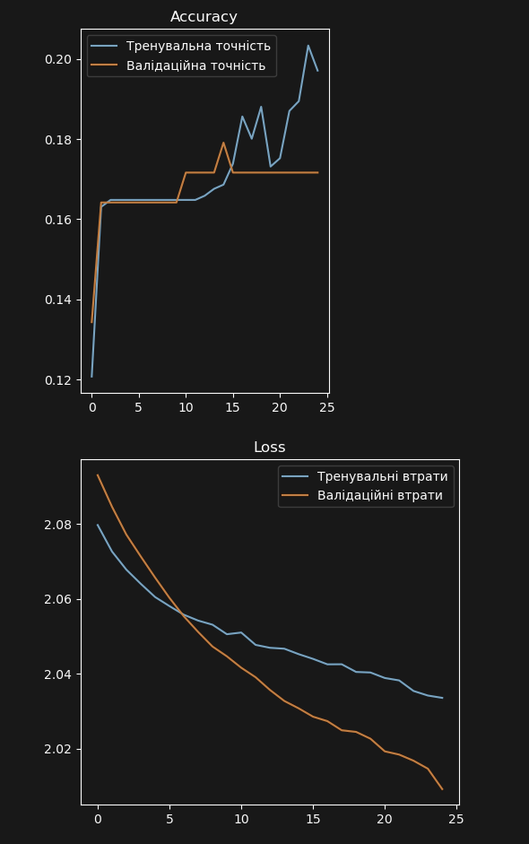

# F1Lens 


Цей проєкт — нейронна мережа для класифікації болідів Формули 1 за зображеннями.

## Датасет
### [Formula One Cars by Sagar Khanna (vesuvius13)](https://www.kaggle.com/datasets/vesuvius13/formula-one-cars)
#### Було проведено ручне очищення датасету: видалено нерелевантні зображення та зображення, які були не відповідали своїм класам. У результаті датасет зменшився більш ніж на чверть: з *2486* до *1677*

#### Команди у датасеті:
- Mercedes
- Ferrari
- McLaren
- Red Bull Racing
- AlphaTauri
- Williams
- Renault
- Racing Point

## Реалізовано
- Завантаження датасету через kagglehub
- Аугментація шляхом повороту зображення на 45 градусів та віддзеркалення.
- Розділення на:
- - train (72% + augmentation 100% ) 
- - val (8%) 
- - test (20%)
- Створені відповідні DataLoader'и до кожної множини
- Візуалізація по елементу з кожного класу

## Результати базових тренувань
#### 10 епох:


#### 25 епох:


#### 50 епох:

```
cnn_f1_10epochs.pt
Точність: 0.1791
F1 Score: 0.0567

cnn_f1_25epochs.pt
Точність: 0.1716
F1 Score: 0.0499

cnn_f1_50epochs.pt
Точність: 0.2612
F1 Score: 0.1751
```

## Старт
```bash
conda create -n F1Lens python=3.12
conda activate F1Lens

jupyter notebook F1Lens.ipynb
```
Після чого можна запускати комірки по-черзі.