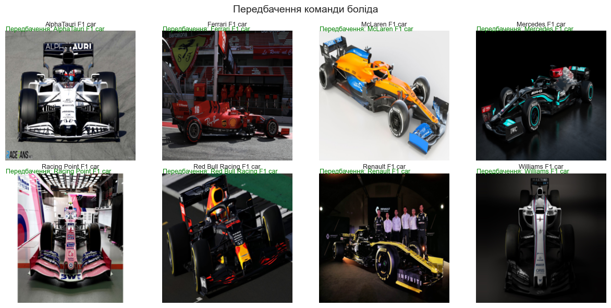
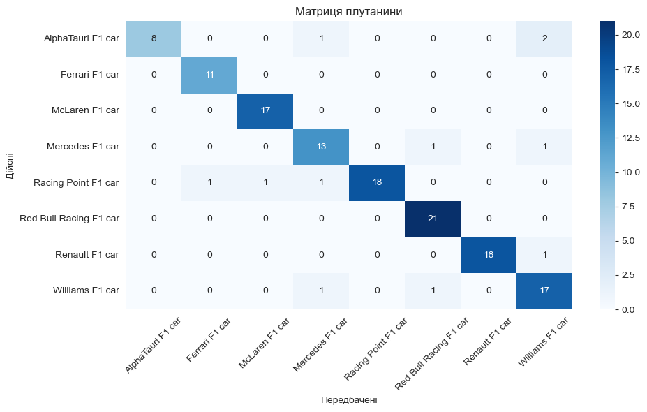

# F1Lens 


Цей проєкт — нейронна мережа для класифікації болідів Формули 1 за зображеннями.

## Датасет
### [Formula One Cars by Sagar Khanna (vesuvius13)](https://www.kaggle.com/datasets/vesuvius13/formula-one-cars)
#### Було проведено ручне очищення датасету: видалено нерелевантні зображення та зображення, які були не відповідали своїм класам. У результаті датасет зменшився більш ніж на чверть: з *2486* до *1677*

#### Команди у датасеті:
- Mercedes
- Ferrari
- McLaren
- Red Bull Racing
- AlphaTauri
- Williams
- Renault
- Racing Point

- Поділ датасету:
- - train (72% + augmentation 100% ) 
- - val (8%) 
- - test (20%)

## Результати базових тренувань

```
10 епох
Точність: 0.1791
F1 Score: 0.0567

25 епох
Точність: 0.1716
F1 Score: 0.0499

50 епох
Точність: 0.2612
F1 Score: 0.1751
```

## Автоматизована оптимізація
За результатами автоматизованої оптимізації найкращими параметрами є:
```
{'lr': 0.0005566812682870772, 'optimizer': 'Adam'}
```


## Оптимізована модель
## Adam | LR 0.0005 | 50 epochs

```
Точність: 0.9851
F1 Score: 0.9832
```



## Transfer learning | MobilNetV2 (25 epochs)


```
Точність: 0.9179
F1 Score: 0.9137
```



## Старт
```bash
conda create -n F1Lens python=3.12
conda activate F1Lens

jupyter notebook F1Lens.ipynb
```